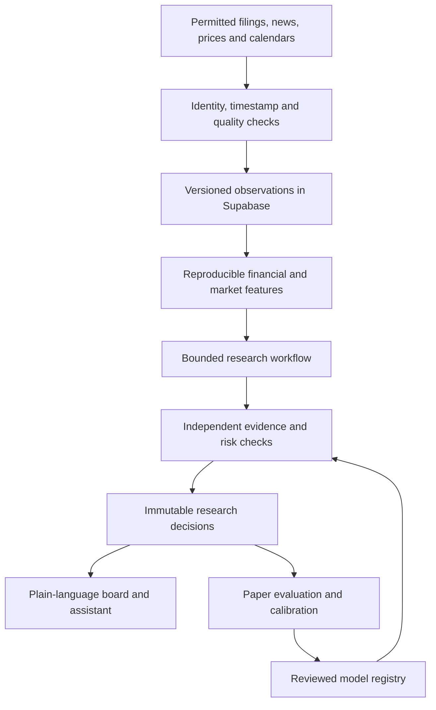

# Earnings Radar: autonomous research and accessible product blueprint

Planning date: October 7, 2026. This is a proposed design, not a deployment or a verified profitable trading system. Read alongside the professional-research memo and copyable implementation prompt. The goal is seamless, trustworthy operation under ordinary conditions and clear recovery under adverse conditions. “Flawless” is an aspiration, not a guarantee.

## 1. Define the product around decisions

The assistant should proactively answer six questions: What deserves attention? What actually changed? Why might that affect the stock? What is already expected? Is a call or put economically reasonable? What would make the idea wrong?

A visitor sees useful research without choosing symbols, supplying figures or constructing a thesis. A personal watchlist is optional; it is distinct from the automatically maintained opportunity board. The system must never mistake an empty personal watchlist for an empty research universe. Initial coverage should be liquid U.S. listed common equities, with on-demand research for additional resolved companies and visible limits for unsupported instruments or jurisdictions. An SEC issuer directory is not a complete worldwide tradable-symbol directory.

The assistant researches both directions and may prefer neither. Buying a call/put is the instrument scope; execution and brokerage account access are excluded. User choice remains necessary for actually spending money. Automation removes research chores, not that decision.

Three separate verdicts appear on every idea:

| Question | Example result | Required evidence |
|---|---|---|
| Business opportunity? | Improving cash generation | Matched-period financials and primary passages |
| Timely stock setup? | Watching for confirmation | Price history, dated mechanism, explicit trigger |
| Reasonable option? | Cannot assess contract yet | Eligible chain, executable bid/ask, horizon, scenarios |

A positive first verdict never silently upgrades the other two. “Unusual activity” means something measurable, not a claim that institutions know a secret.

## 2. Current system versus planned system

The current app has company discovery, official SEC evidence, financial calculations, rule-based directional cases, durable research jobs and a provider-hosted chart integration. The chart's external live rendering was not inspected during this research session. Its displayed values are not backend inputs. Existing descriptive statistics are not calibrated predictions. Current daily Vercel scheduling is not an always-on stream. Current news feeds do not constitute a licensed full-text financial-news archive. Options-chain eligibility, continuous autonomous AI, verified public feed rights and calibrated trade evaluation are additional work.

The first implementation deliverable must be an actual production capability report, with a secure authenticated diagnostics endpoint and a human-readable health page. Record presence/absence of credentials without revealing them; test provider responses through the deployed server; check freshness and available feed scope; distinguish credentials configured, authentication successful, observations received, public display permitted, and analytically eligible. These are five different states.

## 3. System architecture

Vercel serves the web interface and bounded API requests. Supabase stores relational state, permissions, jobs, evidence and decisions. Supabase Realtime can deliver changes in stored records; it does not itself create a stock-price feed. An always-on WebSocket market collector needs infrastructure that supports a persistent connection; do not describe a Vercel request function or once-daily cron as that collector.

Zero-payment mode uses bounded, batched polling while pages are visible, cached shared observations, opportunistic research jobs and available free scheduling within actual provider limits. This mode must be described as periodic/on-demand rather than continuous. A persistent-worker option remains separately budgeted. Never enable a paid account, model or service by default.

The interface can show a permitted hosted chart while the research backend is delayed or unavailable. Give each its own timestamp and status. Do not scrape the frame into a model or imply that visual access grants redistribution rights.

## 4. Data contracts and database design

Use additive migrations and preserve existing account records. Proposed logical tables can be adapted to existing names:

| Entity | Essential fields and constraints |
|---|---|
| issuers | Stable issuer ID, legal name, CIK when relevant, country, sector, identity provenance |
| instruments | Exchange, symbol history, asset type, currency, issuer, valid-from/to, listing/delisting dates |
| corporate_actions | Split/dividend/merger, effective date, source, adjustment version |
| sources | Publisher, adapter, terms reference, feed scope, allowed uses, limits, last successful check |
| observations | Source ID, instrument, observation kind, event/publication/receipt times, revision, value/unit, original-document reference |
| documents | Canonical URL, content hash, permitted retained text, parser version, language, publication time |
| claims | Normalized claim, supporting passage, source independence group, contradiction links, extraction method |
| fiscal_facts | Concept, unit, fiscal period, duration, filing time, restatement lineage, sector applicability |
| market_bars | Feed, interval, timezone/session, OHLCV, adjustment status, coverage flag |
| option_quotes | OCC identifier, underlying, expiry, strike, call/put, bid/ask sizes, quote timestamp, feed, multiplier, adjusted-contract flag |
| catalysts | Type, confirmed/estimated, time/date precision, revision and verification source |
| features | Feature/version, window, source observation IDs, cutoff, value, missing reason, applicability |
| research_jobs | Idempotency key, lease, attempts, deadline, workflow version, status, dependency IDs |
| research_decisions | Immutable ID, as-of cutoff, state, strategy version, features, claims, counterevidence, invalidation rules, eligibility result |
| evaluations | Decision ID, horizon, underlying and contract outcomes, entry/exit assumptions, benchmark, missing-data flags |
| model_registry | Training cutoff, evaluation windows, metrics, intended universe/horizon, approval state, rollback version |
| user_preferences | Private saved ideas, accessibility preferences, opt-in notifications, optional approved risk context |

Do not make unknown values zero. Store reason codes such as NOT_PROVIDED, STALE, WRONG_FEED, WRONG_PERIOD, NON_APPLICABLE and RESTRICTED_USE. Financial facts and option premiums retain currencies, units and multipliers. Option open interest is generally a separately dated field; it is not a live order-book measure.

Public research records and private user records have different access policies. Enable and verify RLS for personal data. Service credentials remain server-only. Restricted raw market/news data must not become public simply because it is in Supabase. Store retention and downstream-use constraints with the source.

## 5. Source acquisition and credibility

Use primary SEC filings and issuer releases for financial statements and material disclosures. Use central banks, statistical agencies and official regulators for macro/regulatory facts. Use permitted financial-news APIs/RSS for discovery and attribution. A headline can identify an event; numerical analysis requires the actual verified datum and timestamp. Use authorized market APIs for bars and quotes.

Bloomberg/WSJ/Seeking Alpha/EarningsHub links do not become content integrations by adding URLs. Where accessible through permitted feeds, extract allowed metadata and cite it. Do not bypass paywalls or reproduce licensed articles. Use official underlying releases or other independent reporting to corroborate facts. Label unavailable consensus and analyst estimates instead of manufacturing them.

Every adapter needs a fixture, live diagnostics, timeout, backoff, rate-limit budget and data-use classification. Cross-check material discrepancies. When two prices disagree, inspect feed coverage, delay, exchange session, adjustment, currency and instrument identity before averaging. Quarantine suspicious observations. Do not use a fallback with different semantics under the original feed label.

Primary source does not mean infallible: company disclosures have incentives, revisions occur, accounting definitions vary, and official publication dates matter. Store claims separately from analyst interpretations.

## 6. Research workflow and limits

The workflow is a dependency graph with strict budgets. Resolve instrument identity; obtain permitted observations; reconcile times and periods; calculate deterministic features; run the relevant analysts; search for counterevidence; assess strategy eligibility; apply risk vetoes; publish an immutable decision; schedule evaluation.

Logical agent roles are discovery, fundamentals, market structure, volatility, catalyst, expectations, strategy, skeptic, risk and evaluation. Their outputs are typed objects containing claims, supporting evidence, calculation IDs, missing inputs and proposed next tasks. The same source repeated by several agents is still one source. LLM agreement is not independent confirmation.

Suggested initial engineering limits, all configurable proposals: at most two targeted discovery passes per case, one contradiction pass, bounded document counts/bytes, bounded tokens, wall-clock deadlines and per-user/global request budgets. Choose actual values after measuring the existing deployment. Do not recursively let agents spawn agents or browse indefinitely. An expensive retrial needs a concrete missing question to resolve.

Retrieved pages are untrusted data. Ignore embedded instructions to change tools, expose secrets or send money. Restrict network tools to approved destinations; prevent SSRF to private IPs/cloud metadata; validate redirects. The model proposes calculations; tested code calculates. A deterministic validator verifies numerical assertions before publication.

## 7. Financial feature specification

Price layer: log returns; 5/20/60-session realized volatility; true range/ATR; gap and intraday range; market/sector-relative return; rolling beta with sample diagnostics; drawdown; volume relative to comparable sessions from the same feed. IEX-only volume cannot support claims about total-market institutional activity.

Fundamental layer: comparable-period sales/margin growth; CFO versus earnings; free cash flow with capex definition; cash and accessible funding; debt maturities; interest expense coverage where meaningful; working-capital changes; stock compensation/dilution; segment concentration; guidance changes. Separate annual, quarterly, year-to-date and trailing periods. Avoid double-counting year-to-date statements. Require restatement lineage.

Sector layer: banks need capital, deposits, asset/liability duration and funding disclosures; insurers need reserve and underwriting context; REITs need relevant cash-flow metrics and financing; pre-revenue firms need cash burn/runway with funding uncertainty. A generic current ratio or enterprise-value formula is not universally applicable.

Options layer: actual contract quotes and metadata; bid/ask width and sizes; IV/Greeks when supported; expiry; event ordering; dividend/exercise considerations; adjusted multipliers. Model-derived values are labeled as such with assumptions. IV is not actual realized volatility, delta is not the chance of profit, and risk-neutral distributions are not real-world forecasts.

## 8. Entry criteria by strategy

| Playbook | Required mechanism | Candidate trigger | Mandatory rejection or downgrade |
|---|---|---|---|
| Fundamental catalyst | Verified business change plus dated repricing mechanism | New guidance/filing/event consistent with historical-period evidence | No timely catalyst for the selected option; weak period comparability |
| Trend continuation | Persistent own-price and relative strength, regime context | Reproducible breakout/pullback confirmation defined before evaluation | Gap chasing without validated rule; weak liquidity; solely headline-driven |
| Volatility expansion | Measurable change in variance/range plus identifiable uncertainty | Confirmed regime change or dated event | High historical vol alone; option already excessively expensive |
| Funding pressure | Issuer-specific near-term obligations and constrained resources | Financing disclosure, maturity approaching, liquidity deterioration | Bank/insurer generic ratio misuse; unverifiable insolvency claim |
| Expectations divergence | Dated observable expectation benchmark | New primary evidence contradicts the benchmark | “Everyone thinks” without measurement; old consensus |
| Event uncertainty | Verified event and empirically characterized outcomes | Event window with valid instrument economics | Treating uncertainty as direction; unsupported historical option prices |

Exact trigger parameters must be registered before out-of-sample testing. They are proposed research hypotheses, not copied hedge-fund entry rules. Avoid one weighted “genie score” that hides disagreements. Display evidence strength, data completeness and model validation separately.

## 9. Option economics and eligibility

For a standard long call at expiry: profit = multiplier × (max(S_T − K, 0) − premium) − applicable costs. For a long put: multiplier × (max(K − S_T, 0) − premium) − costs. Standard contracts often have multiplier 100; inspect actual contract metadata. Expiry break-even is strike plus/minus premium before fees. Pre-expiry exits require a contract valuation or actual quote and depend on time/IV; do not apply expiry formulas to a planned early exit.

Compare buying the option with waiting and with an underlying-only research view. Show down/flat/up scenarios and IV/time sensitivity. A correct directional move may fail to cover premium. Do not label expected value positive without empirically justified probabilities appropriate to the actual instrument and horizon.

Proposed starting screen, requiring validation: market-session stock quotes within 15 seconds, options quotes within 30 seconds; investigate option spreads exceeding 10% of mid or $0.20; consider actual deltas 0.35–0.65 and expiries 14–60 days with event buffers; exclude zero-day and very short weekly options initially. These are adjustable product research defaults, not universal optimum thresholds. Locked/crossed quotes, zero bids, missing sizes, indicative-only feeds, adjusted contracts without support and unknown event dates require explicit handling. Closed-market snapshots remain research context, not live entry signals.

Without an approved user budget, show one-contract premium exposure only and state that portfolio sizing is unassessed. Do not assume the user holds no correlated positions. Defined premium risk does not make every option suitable; expiration/exercise can have additional operational consequences that the explanation must cover. Underlying invalidation prices are research triggers, not guaranteed option stop execution prices.

## 10. Model validation and learning

Start with descriptive features and rule-based conditional scenarios. Add forecasts only after point-in-time evaluation is possible. Separate underlying-direction models, volatility forecasts and contract-return models. Train with publication timestamps, delisted instruments, corporate actions and historical revisions. Prevent survivorship/lookahead leakage and overlapping-event contamination.

Use chronological walk-forward splits; purge overlapping labels when applicable; reserve a final untouched test interval; record every parameter trial. Compare simple baselines, including no recommendation. Evaluate calibration, Brier/log loss for probabilities, coverage/abstention, turnover, tail loss, drawdown and cost sensitivity. Report uncertainty and performance by sector/regime/horizon. Small samples do not establish predictive ability.

Historical options backtests require historical chain/quotes or a clearly labeled approximation. Free underlying bars cannot establish historical achievable option fills. Paper outcomes are not live fills. Do not optimize a headline win rate while ignoring premium loss, slippage and selection bias.

Learning is offline and versioned. A new model cannot rewrite its own acceptance standard or promote itself. Deteriorating performance/freshness triggers abstention or rollback. Preserve previous decision content and later evaluations separately.

## 11. Interface for a nonfinance user

Home: “What deserves your attention today?” Use accessible stock tiles inspired by familiar pick boards, without betting urgency or guaranteed-win language. Each tile shows company/name, timestamp/feed badge, direction or uncertainty, one-sentence mechanism, next event and current research state. The automated board has content even if the personal watchlist is empty.

Opening a tile shows: what changed; what it could mean; what supports it; what could prove it wrong; timing; option economics when available; source evidence. The first screen uses plain language. Technical formulas, source IDs and parser details belong in expandable research views. Evidence links land on relevant human-readable passages or official documents, with filing name/date and a cited section, rather than raw JSON/code.

Replace “enter your strategy” with an automatically drafted two-sided case. Up/Down are exploration actions, not confirmation bias: both views expose the strongest opposing evidence. “Why no idea?” explains missing eligibility and what the system is checking next. “What changed since yesterday?” uses immutable comparison, not regenerated narrative guesswork.

Conversation answers use the selected decision and current approved data. Show timestamp and whether new research was run. A request outside data coverage receives a specific bounded answer. No simulated research progress or fake live badges.

Mobile navigation: Today, Company search, Saved, Ask. Keyboard access, screen-reader labels, responsive chart fallback, sufficient contrast, reduced-motion support and noncolor direction indicators are required. Target novice usability: a participant can identify the company, uncertainty, event, maximum premium exposure and invalidation in about a minute without prior explanation. Conduct observed tests; this is an acceptance target, not a verified result.

## 12. Reliability, privacy and operational controls

Jobs are idempotent with leased ownership, bounded retries, backoff/jitter and dead-letter review. Expired leases are recoverable; duplicate execution cannot publish duplicate decisions. A daily reconciliation identifies missed filings and stale symbols. Use cursor pagination and incremental extraction; avoid loading the entire universe/documents into function memory.

Cache raw eligible observations by feed/instrument/window and calculations by input hashes/version. Private decisions/preferences never leak through shared caches. API handlers validate query limits, prevent cross-user access and avoid unbounded ticker fan-out.

Define measurements before promising service levels: successful collector rate, observation age percentiles, evidence-link validity, queue depth/age, publication latency, blocked-reason distribution, model cost, error rate, memory and RLS violations. Suggested launch objectives are measured bounded request latency, zero uncited numerical claims in audited samples and explicit stale-state rendering; they are not currently achieved guarantees.

Runbooks: provider outage → retain timestamped research, halt eligibility upgrades; expired credential → server diagnostics with secret-safe reason; schema failure → stop writes and rollback compatible app; model timeout → deterministic partial report; malformed filing → quarantine source and use prior verified facts; high cost → enforce budget and pause AI; suspected leakage → disable affected forecasts and preserve audit evidence.

## 13. Free-tier feasibility

| Capability | Immediately useful design | Additional dependency |
|---|---|---|
| Company/SEC research | Existing collector plus deeper extraction and better explanations | Correct identification and fair-access compliance |
| News discovery | Permitted RSS/official releases with provenance | Each publisher's access/use terms |
| Hosted price chart | Existing visual integration | Actual external rendering and feed delay verification |
| Machine-readable prices | Provider adapter with diagnostics/cache | Credentials, appropriate scope and downstream-use entitlement |
| Broad periodic discovery | Bounded prioritized jobs | Scheduler/compute/database free-tier capacity |
| Hosted generative assistant | Optional bounded adapter, deterministic fallback | Free credential/quota or separately approved spending |
| Specific option comparisons | Eligibility pipeline can be built | Suitable quote/chain feed and usage rights; indicative data insufficient for live entry |
| Always-on consolidated market/OPRA stream | Architecture can be prepared | Persistent compute and appropriate entitlements; free availability cannot be assumed |
| Full Bloomberg/WSJ archive or proprietary research | Links/allowed metadata and primary-source corroboration | Authorized access; no licensing workaround |
| Calibrated profitable predictions | Evaluation framework can be built | Adequate point-in-time datasets and successful tests; never guaranteed |

Free tiers have changing quotas and may pause/sleep. Supabase storage does not remove market-data or compute costs. A credible zero-payment product can offer useful autonomous periodic research; it cannot promise unrestricted global real-time institutional infrastructure.

## 14. Implementation sequence and release gates

Phase 0 — audit: repository/deployed capability map, data-use inventory, schema/RLS inspection, secret-safe connectivity tests. Exit: each source's actual state documented, current behavior reproducible.

Phase 1 — usable price/data foundation: eligible backend quotes/bars, historical chart fallback, coverage/timestamp labels, identity/actions, batch cache, stale-state handling. Exit: selected instruments have verified bars and correct statuses; no chart-only data mistaken for backend input.

Phase 2 — deep evidence: matched-period financials, meaningful passages, permitted news deduplication, confirmed catalysts, sector logic. Exit: audited numerical claims trace to exact observations; corrections preserved.

Phase 3 — autonomous workflow: structured agents, typed output, skeptic/risk gates, durable jobs, proactive broad board. Exit: missing inputs produce explicit partial research; no uncontrolled recursion or empty-watchlist dependence.

Phase 4 — options research: eligible chains, contract identity, scenarios, spreads, horizon comparisons, unassessed-sizing mode. Exit: indicative/stale/malformed contracts rejected; payoff calculations verified with independent examples.

Phase 5 — paper evaluation: point-in-time archive, realistic costs, registered playbooks, chronological tests, model registry. Exit: forecasts remain disabled unless evaluated eligibility is approved; descriptive analysis remains useful.

Phase 6 — accessible assistant: automatic cases, change feed, bounded conversation, novice/mobile/accessibility testing and optional alerts. Exit: nonfinance users understand the decision and uncertainty; alerts respect explicit opt-in and freshness.

Cross-phase acceptance: no credential exposure, no private-user leakage, no brokerage execution, no unexplained probability, no unsupported real-time badge, no public restricted data, and no silent paid-service activation. Test meaningful financial/data/security behavior rather than merely mirroring component implementation.

## 15. Adversarial scenario checklist

1. Good earnings, expensive calls: retain positive business view but withhold attractive-contract conclusion.
2. Correct direction, post-event IV collapse: scenario demonstrates possible option loss.
3. Quiet stock without catalyst: show compression descriptive only; no imminent-breakout claim.
4. Bank current ratio looks poor: mark generic metric non-applicable and use sector evidence.
5. IEX volume spike: do not label a consolidated institutional-volume anomaly.
6. Market closed: label last session and disable live entry eligibility.
7. Indicative option quote: allow educational scenario, reject executable-contract recommendation.
8. Revised earnings date: supersede catalyst, invalidate affected horizons, preserve earlier decision.
9. Syndicated headlines: deduplicate to one event and distinguish original reporting.
10. Malicious filing text: treat instruction content as evidence only and deny tool redirection.
11. Provider outage: cache with visible age, stop upgrades, recover automatically within budgets.
12. Corporate split or adjusted option: reconcile identity/multiplier or block calculation.
13. Model invents consensus: validator rejects unsupported benchmark.
14. Unknown holdings: no fabricated personalized allocation or diversification claim.
15. Job repeats after crash: same input/version yields one committed decision.
16. News published after historical trade timestamp: exclude it from that backtest decision.
17. Strong backtest after hundreds of trials: flag selection bias; require untouched evaluation.
18. Search unsupported foreign issuer: explain coverage and provide verified available research rather than wrong U.S. ticker mapping.
19. Chart works but backend price feed fails: retain chart status separately and block price-dependent model output.
20. Every signal abstains: show the researched universe, reasons and next checks; do not manufacture picks to fill the board.

## 16. Definition of done for planning

This document defines intended architecture and acceptance criteria. Implementation should produce concrete migrations, adapter diagnostics, test evidence and staged deployments, rather than claiming that writing an LLM prompt created an autonomous system. Before spending or changing deployment, verify authorization and actual free-tier capabilities. This planning task does not modify production or push to GitHub.
